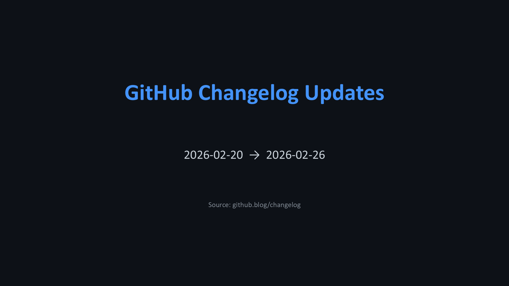
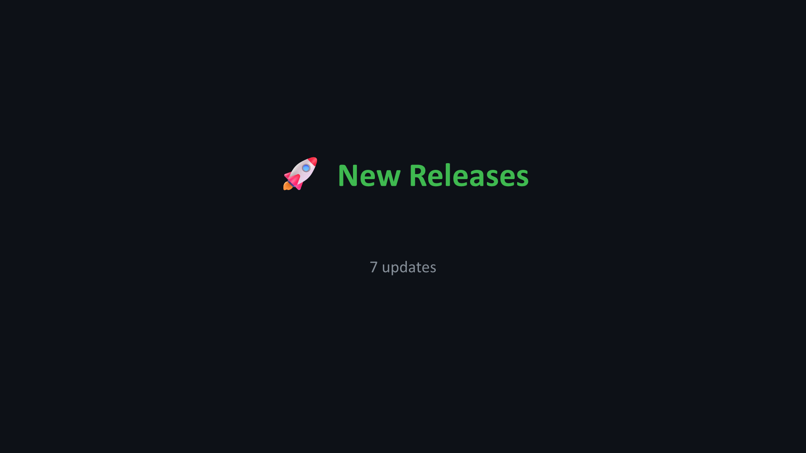
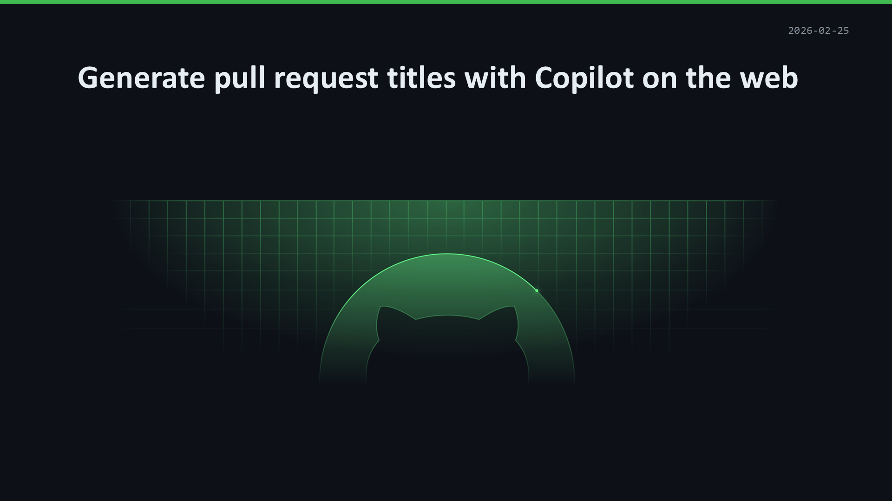
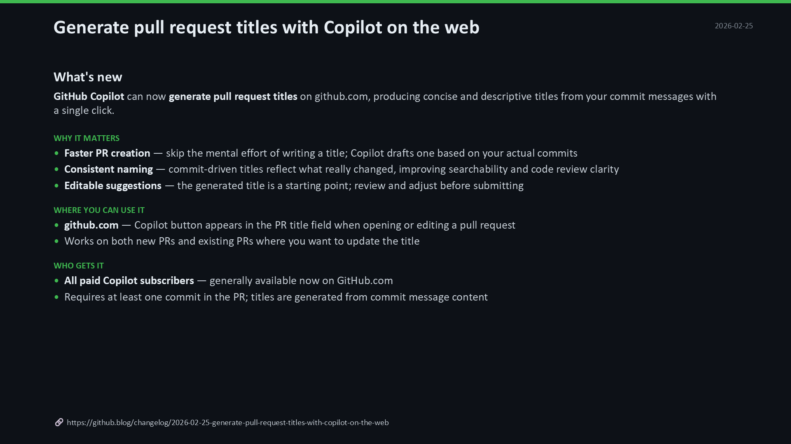

<div align="center">

<br/>

# Copilot Updates

**Turn GitHub changelog articles into polished, presentation-ready slides — automatically.**

<br/>

[](https://github.com/features/copilot)
[](https://www.python.org)
[](LICENSE)

<br/>

[](https://github.com/g-mercuri/copilot-updates/stargazers)
[](https://github.com/g-mercuri/copilot-updates/commits)
[](https://github.com/g-mercuri/copilot-updates/issues)

---

*Fetch · Summarize · Translate · Present — in under 5 minutes.*

</div>

<br/>

<p align="center">
  <a href="#-the-opportunity">Why</a>&nbsp;&nbsp;·&nbsp;&nbsp;
  <a href="#-how-it-works">How</a>&nbsp;&nbsp;·&nbsp;&nbsp;
  <a href="#-example-output">Demo</a>&nbsp;&nbsp;·&nbsp;&nbsp;
  <a href="#-getting-started">Quick Start</a>&nbsp;&nbsp;·&nbsp;&nbsp;
  <a href="#-usage">Usage</a>&nbsp;&nbsp;·&nbsp;&nbsp;
  <a href="#%EF%B8%8F-configuration">Config</a>&nbsp;&nbsp;·&nbsp;&nbsp;
  <a href="#-contributing">Contribute</a>
</p>

<br/>

## 🎯 The Opportunity

GitHub ships product updates **every single week** — across Copilot, Actions, Security, and more.

For any team that tracks these changes, the same recurring challenge surfaces: **how do you stay on top of everything, and share what matters with your audience in a meaningful way?**

Today, the answer is usually manual:

- 📰 Someone reads through dozens of changelog articles
- 🔍 Picks what's relevant for their team or audience
- ✍️ Writes summaries, formats slides, repeats this every week

**That's hours of low-leverage work — done by people who should be doing something harder.**

<br/>

## ✨ How It Works

This repository is a **working AI pipeline** powered by a **repo-local Copilot skill that orchestrates everything** — it calls Python scripts for deterministic work (scraping, validation, indexing, slide generation) and uses AI only for what requires it: writing structured summaries and speaker notes. The result is a **polished, multilingual PowerPoint presentation** — automatically.

<table>
<tr>
<td width="60%">

```
  ┌──────────────────────────────────────┐
  │        Copilot Skill 🤖              │
  │        (orchestrator)                │
  │                                      │
  │  1. fetch_articles.py                │
  │     └─ scrape github.blog/changelog  │
  │                                      │
  │  2. process_articles.py --prepare    │
  │     └─ plan batch from raw articles  │
  │                                      │
  │  3. AI summarization                 │
  │     └─ generate summaries + notes    │
  │                                      │
  │  4. process_articles.py --validate   │
  │     └─ check output format           │
  │                                      │
  │  5. process_articles.py --index      │
  │     └─ build index.md                │
  │                                      │
  │  6. create_pptx.py                   │
  │     └─ assemble final slides         │
  └──────────────┬───────────────────────┘
                 ▼
          📊 presentation.pptx
```

</td>
<td>

### ⏱️ Time saved per week

| Task | Before | After |
|:---|:---:|:---:|
| Read & filter articles | ~60 min | **0** |
| Write summaries | ~5 min × N | **0** |
| Translate content | ~2 hrs/lang | **0** |
| Format slides | ~30 min | **0** |
| **Total** | **3–4 hrs** | **< 5 min** |

</td>
</tr>
</table>

> [!NOTE]
> The Copilot skill is **repo-local**: it works in this repository because it wraps the scripts, config, references, and output structure that already live here. The skill supplies workflow knowledge; the Python scripts still do the heavy lifting.

<br/>

## 📸 Example Output

Every generated presentation uses a **dark GitHub-themed design** (16:9 widescreen) with four slide types:

<table>
<tr>
<td align="center" width="50%">

**Title Slide**



<sub>Date range, active label filters, and source</sub>

</td>
<td align="center" width="50%">

**Section Divider**



<sub>Category header with article count</sub>

</td>
</tr>
<tr>
<td align="center">

**Article Hero**



<sub>Article title with hero image and date</sub>

</td>
<td align="center">

**Summary**



<sub>Structured content with source link & speaker notes</sub>

</td>
</tr>
</table>

> [!TIP]
> Summaries and speaker notes can be generated in **any language**. Article titles and technical terms always stay in English.

<p align="right"><a href="#changelog--powerpoint">⬆ back to top</a></p>

---

## 🚀 Getting Started

### Prerequisites

| Requirement | Notes |
|:---|:---|
| [Python 3.11+](https://www.python.org) | Core runtime |
| [VS Code](https://code.visualstudio.com/) + [GitHub Copilot](https://github.com/features/copilot) | Optional for chat-based usage |

### Installation

```bash
uv sync
```

<details>
<summary>💡 <strong>Alternative: plain venv / pip</strong></summary>

<br/>

```bash
python -m venv .venv
.venv\Scripts\Activate.ps1   # Windows
source .venv/bin/activate    # macOS / Linux
pip install .
```

</details>

<p align="right"><a href="#changelog--powerpoint">⬆ back to top</a></p>

---

## 📖 Usage

### Option A — Copilot Skill ✨ <sub>(recommended)</sub>

<table>
<tr>
<td>

#### VS Code

Open Copilot Chat in this repository and ask Copilot to use the **`/copilot-updates`** skill.

</td>
<td>

#### Copilot CLI

This repository now ships an auto-discovered skill at `.github/skills/copilot-updates/SKILL.md`.

You can ask in natural language, or invoke it explicitly:

```
Run the copilot-updates pipeline
for copilot articles
from 2026-02-01 to 2026-02-25
in italian
```

```text
Use the /copilot-updates skill to create a weekly GitHub changelog presentation
for copilot,actions
from 2026-02-01 to 2026-02-25
in italian
```

</td>
</tr>
</table>

In Copilot CLI, use `/skills list` to confirm the skill is available and `/skills reload` after editing files under `.github/skills/`.

You'll be prompted for:

| Input | Example | Description |
|:---|:---|:---|
| `startDate` | `2026-02-01` | Start of the date range |
| `endDate` | `2026-02-25` | End of the date range |
| `labels` | `copilot,actions` or `all` | Which changelog labels to include |
| `language` | `italian`, `english`, `spanish` | Output language for summaries |

The skill orchestrates the full pipeline end-to-end:

```
Fetch → Prepare → Summarize → Validate → Index → PowerPoint
```

In practice, the important boundary is:

- `fetch_articles.py`, `process_articles.py`, and `create_pptx.py` do the deterministic work
- the skill reads `output/batch.json`, writes each processed article file under `output/{locale}/...`, and then resumes the scripted pipeline
- before validation, every `target_file` in `output/batch.json` should exist on disk

> [!TIP]
> Re-running for the same date range is safe — both the scraper and the skill skip articles that already have output files.

<br/>

### Option B — Manual CLI

<details open>
<summary><strong>1️⃣ Fetch raw articles</strong></summary>

<br/>

```bash
python fetch_articles.py --labels copilot --from-date 2026-02-01 --to-date 2026-02-25
```

<details>
<summary>More examples & flags</summary>

```bash
# Multiple labels
python fetch_articles.py --labels copilot,actions,client-apps --from-date 2026-02-01 --to-date 2026-02-25

# All labels
python fetch_articles.py --labels all --from-date 2026-02-01 --to-date 2026-02-25
```

| Flag | Default | Description |
|:---|:---|:---|
| `--labels`, `-L` | `copilot` | Comma-separated label slugs, or `all` |
| `--from-date` | *required* | Start date (YYYY-MM-DD) |
| `--to-date` | *required* | End date (YYYY-MM-DD) |
| `--output-dir`, `-d` | `output/` | Output directory |

</details>

</details>

<details open>
<summary><strong>2️⃣ Process articles</strong></summary>

<br/>

```bash
python process_articles.py --prepare --locale en \
  --from-date 2026-02-01 --to-date 2026-02-25
```

> Between `--prepare` and `--validate`, run the Copilot skill (or write summaries manually) to generate the structured article files.

Then verify that every `target_file` listed in `output/batch.json` exists, and continue:

```bash
python process_articles.py --validate --locale en
python process_articles.py --index --locale en
```

> [!TIP]
> `--prepare` only builds `output/batch.json`. It does **not** generate translated summaries by itself.

> [!TIP]
> If you write summaries manually, assemble the full file: front matter, `#` title, optional ``, `---`, then the structured body. Validation may pass even if a file is missing from the expected date range, so it is worth checking the batch manifest before generating the deck.

<details>
<summary>Flags</summary>

| Flag | Default | Description |
|:---|:---|:---|
| `--prepare` | — | Scan raw files and produce `output/batch.json` |
| `--validate` | — | Validate processed article files |
| `--index` | — | Generate/update `index.md` |
| `--locale`, `-l` | `en` | Locale code |
| `--from-date` | *(none)* | Start date filter (YYYY-MM-DD) |
| `--to-date` | *(none)* | End date filter (YYYY-MM-DD) |
| `--labels`, `-L` | *(all)* | Comma-separated label slugs to filter |
| `--output-dir`, `-d` | `output/` | Output directory |

</details>

</details>

<details open>
<summary><strong>3️⃣ Generate the PowerPoint</strong></summary>

<br/>

```bash
python create_pptx.py --locale it --from-date 2026-02-01 --to-date 2026-02-25
```

<details>
<summary>More examples & flags</summary>

```bash
python create_pptx.py --label copilot
python create_pptx.py --label copilot,actions --categories new-release,improvement
```

| Flag | Default | Description |
|:---|:---|:---|
| `--output-dir`, `-d` | `output/` | Root directory containing locale subfolders |
| `--locale`, `-l` | `en` | Locale subfolder to read from |
| `--output`, `-o` | auto-generated | Output `.pptx` filename |
| `--from-date` | auto-detected | Start date filter |
| `--to-date` | auto-detected | End date filter |
| `--label`, `-L` | *(all)* | Comma-separated label slugs to filter by |
| `--categories`, `-c` | *(all)* | Comma-separated categories: `new-releases`, `improvements`, `deprecations` |

</details>

</details>

<p align="right"><a href="#changelog--powerpoint">⬆ back to top</a></p>

---

## ⚙️ Configuration

All labels, categories, colors, and defaults live in [`config.yaml`](config.yaml).

<details>
<summary>📋 <strong>Supported labels</strong> <sub>(13 labels)</sub></summary>

<br/>

| Slug | Display Name |
|:---|:---|
| `account-management` | Account Management |
| `actions` | Actions |
| `application-security` | Application Security |
| `client-apps` | Client Apps |
| `collaboration-tools` | Collaboration Tools |
| `community-engagement` | Community Engagement |
| `copilot` | Copilot |
| `ecosystem-and-accessibility` | Ecosystem & Accessibility |
| `enterprise-management-tools` | Enterprise Management Tools |
| `platform-governance` | Platform Governance |
| `projects-and-issues` | Projects & Issues |
| `supply-chain-security` | Supply Chain Security |
| `universe25` | Universe '25 |

</details>

<details>
<summary>📄 <strong>Article format</strong></summary>

<br/>

Each processed article follows this markdown structure:

```markdown
---
title: "Article Title"
date: "2026-02-15"
type: "new-releases"
labels: ["copilot", "client-apps"]
image_url: "https://github.blog/wp-content/uploads/..."
article_url: "https://github.blog/changelog/2026-02-15-slug"
---

# Article Title


---

## What's new

One-liner with **key product/feature** and **status**.

### Why it matters
- **Key benefit 1** — short explanation
- **Key benefit 2** — short explanation

### Where you can use it
- **Platform 1** — details

### Who gets it
- Plans, rollout info

<!-- speaker_notes: Speaker notes in the target language (5–8 sentences). -->
```

The `##` heading varies by type: `What's new` (new-releases), `What changed` (improvements), `What's deprecated` (deprecations).

</details>

<p align="right"><a href="#changelog--powerpoint">⬆ back to top</a></p>

---

## 📂 Project Structure

```
copilot-updates/
├── .github/
│   ├── skills/
│   │   ├── copilot-updates/
│   │   │   ├── SKILL.md                   # Auto-discovered Copilot CLI skill
│   │   │   └── references/                # Skill-local summarization rules
│   │   └── make-skill-template/
│   │       └── SKILL.md                   # Downloaded skill template reference
├── imgs/                                  # Fallback hero images + slide examples
├── output/                                # Generated artifacts (git-ignored)
│   ├── raw/                               # Scraped raw articles (language-independent)
│   └── {locale}/                          # Processed articles per language
│       ├── index.md
│       ├── new-releases/
│       ├── improvements/
│       └── deprecations/
├── config.yaml                            # Centralized configuration
├── fetch_articles.py                      # Stage 1 — Web scraper
├── process_articles.py                    # Stage 2 — Batch planning, validation, indexing
├── create_pptx.py                         # Stage 3 — PowerPoint generator
└── pyproject.toml                         # Project metadata & dependencies
```

---

## 🤝 Contributing

Contributions are welcome! Here's how to get started:

1. **Fork** the repository
2. **Create** a feature branch (`git checkout -b feature/amazing-feature`)
3. **Commit** your changes
4. **Open** a Pull Request

> [!IMPORTANT]
> When adding new categories or labels, update `config.yaml` — all scripts read it at startup.

<p align="right"><a href="#changelog--powerpoint">⬆ back to top</a></p>

---

## 🙏 Credits

Special thanks to [@congiuluc](https://github.com/congiuluc) for conceiving and inspiring this solution.

Built entirely with [GitHub Copilot](https://github.com/features/copilot).

---

<div align="center">

**[MIT License](LICENSE)** · Made with ❤️ and 🤖

</div>
